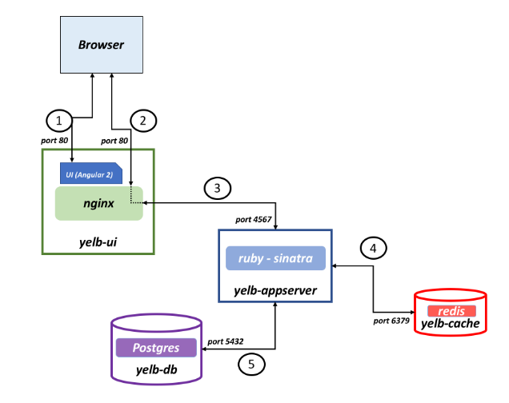

# Deployment Instruction

### Sample App

Yelb allows users to vote on a set of alternatives (restaurants) and dynamically updates pie charts based on number of votes received. In addition to that Yelb keeps track of number of page views as well as it prints the hostname of the yelb-appserver instance serving the API request upon a vote or a page refresh. This allows an individual to demo the application solo, or involving people (e.g. an audience during a presentation) asking them to interact by pointing their browser to the application (which will increase the page count) and voting their favorite restaurant.

#### Architecture

The current architecture layout is pretty straightforward.

There is a front-end component called yelb-ui that fullfills a couple of roles (they could even be split if need be). The first role is to host the Angular 2 application (i.e. the UI of the Yelb application). When the browser connects to this layer it downloads the Javascript code that builds the UI itself. Subsequent requests and calls to other application components are proxied via the nginx service running on yelb-ui.

At the time of this writing the only application component that exists is yelb-appserver. This is a Sinatra application that basically read and write to a cache server (redis-server) as well as a Postgres backend database (yelb-db). Redis is used to store the number of page views whereas Postgres is used to persist the votes. Note that the yelb-db container image is nothing more than Postgres (10) customized to create the database schema the application relies on.

The picture below shows the architecture of Yelb:


```
oc new-project sample-app
oc create sa yelb
oc adm policy add-scc-to-user anyuid system:serviceaccount:sample-app:yelb
oc create -f sample-app.yaml
oc expose service/yelb-ui
oc get all
```
